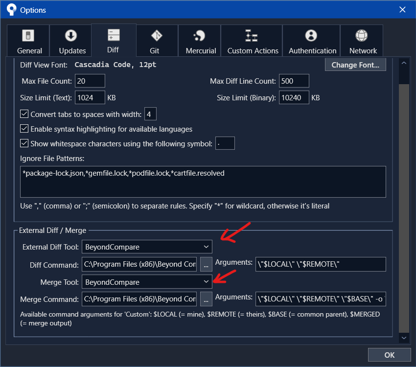

# Sử dụng Git cho Unity

Sử dụng Git để làm hệ thống kiểm soát phiên bản cho Unity cần một số thao tác cài đặt ban đầu nhỏ, nhưng có thể thực hiện rất nhanh chóng bằng các công cụ hỗ trợ và hệ thống [config template](../../configs). Tài liệu này hướng dẫn sử dụng Git với **Large File Storage (LFS)** để xử lý số lượng đáng kể các loại file binary cần sử dụng trong quá trình phát triển game.

> **Note**  
> Tài liệu hướng dẫn sử dụng [SourceTree](https://www.sourcetreeapp.com/) cho Windows

## Cấu hình dự án Unity để sử dụng Git

Có một số cấu hình cần thiết lập từ phía Unity để sử dụng được Git. Các cài đặt sau là mặc định trong các phiên bản mới của Unity _(2018 trở lên)_, nhưng vẫn đáng kiểm tra nhanh để đảm bảo chúng được cấu hình đúng.

- Edit / Project Settings / Editor
  - Version Control
    - Mode: _Visible Meta Files_  
      Thiết lập đảm bảo các `.meta` file mà Unity tạo cùng với tất cả các file và thư mục không bị ẩn trên Git. Git client có thể vẫn sẽ tìm thấy các file này, nhưng làm chúng hiển thị sẽ đảm bảo rằng các máy khác sẽ không gặp vấn đề khi tìm chúng.
  - Asset Serialization
    - Mode: _Force Text_
      Thiết lập đảm bảo Unity lưu trữ các file nội dung dưới dạng văn bản thay vì binary _(mã nhị phân)_. Điều này cho phép hợp nhất **_(merge)_** các thay đổi và cho phép Git lưu trữ thay đổi dưới dạng bản vá nhỏ thay vì sao chép toàn bộ file để tiết kiệm bộ nhớ.


## Cấu hình cài đặt cho người dùng Git

Trước khi **create** hay sao chép **clone** một **repository**, cần cấu hình một vài cài đặt dành riêng cho người dùng Git. Để đặt user name và email sẽ được sử dụng khi thực hiện các thay đổi:

- [SourceTree](https://www.sourcetreeapp.com/) / Tools / Options
  - General: _Default User Information_
    Thiết lập này sẽ điền tên và email của người dùng vào mỗi commit


Thiết lập này cũng được lưu vào file cấu hình `~/.gitconfig` cho người dùng, có thể được chỉnh sửa bằng cách:

- sử dụng [SourceTree](https://www.sourcetreeapp.com/) / Terminal
  - gõ lệnh:
    ```console
    git config --global -e
    ```
    
- tìm đến file tại  
  ```console
  [Ổ đĩa Windows]/Users/[username]/.gitconfig
  ```
  và chỉnh sửa trực tiếp

### Cấu hình UnityYAMLMerge cho Git

Bản cài Unity bao gồm cả một công cụ để hỗ trợ việc merge file `.asset` như `Scene` và `Prefab`. Để công cụ này hoạt động tự động với Git, cần thêm đoạn sau vào mỗi file `.gitconfig` cho mỗi tài khoản người dùng:

```yaml
[mergetool "unityyamlmerge"]
    trustExitCode = false
    keepBackup = false
    cmd = 'C:/Program Files/Unity/Hub/Editor/[phiên bản Unity]/Editor/Data/Tools/UnityYAMLMerge.exe' merge -p \"$BASE\" \"$REMOTE\" \"$LOCAL\" \"$MERGED\"
```

Điều này có thể khá phiền phức nhất là khi vị trí của file UnityYAMLMerge.exe thay đổi dựa trên phiên bản.  
Hiện chưa có giải pháp nào hoàn hảo cho vấn đề này.

### Cấu hình BeyondCompare cho Git

Sau khi install [BeyondCompare]() thì có thể cấu hình ngay bên trong [SourceTree](https://www.sourcetreeapp.com/)

- [SourceTree](https://www.sourcetreeapp.com/) / Tools / Options / Diff tab
  - External Diff Tool: chọn _Beyond Compare_
    - Arguments: `\"$LOCAL\" \"$REMOTE\"`
  - Merge Tool: chọn _Beyond Compare_
    - Arguments: `\"$LOCAL\" \"$REMOTE\" \"$BASE\" -o \"$MERGED\"`



### Cấu hình Custom Action cho SourceTree

Custom Action là các lệnh người dùng tự cấu hình bên trong SourceTree để dễ dàng tự động hoá các thao tác phức tạp bằng câu lệnh.

#### Verify LFS Lockable

Thiết lập tính năng khoá file được push lên Git LFS _(nếu project hỗ trợ)_

- [SourceTree](https://www.sourcetreeapp.com/) / Tools / Options / Custom Actions tab
  - Menu caption: Verify LFS Repository Lockable
  - Script to run: đường dẫn đầy đủ tới vị trí của file `git.exe` trong máy tính, _e.g._ `C:\Program Files\Git\bin\git.exe`
  - Parameter: `config lfs.$REPO/info/lfs.locksverify true`


## Tạo Git Repository

### Bỏ qua các file và thư mục (.gitignore)

### Khởi tạo Git LFS

### Cấu hình Git LFS (.gitattributes)

## Commit thay đổi lên Repository

## Đẩy các thay đổi lên máy chủ

## Clone Repository

## Thay đổi và xung đột
