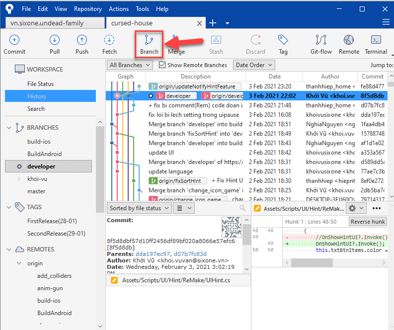
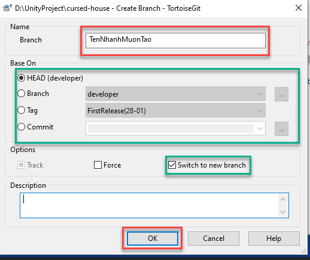

# **Quy** trình sử dụng Git và cách giải quyết khi gặp vấn đề

Để việc phát triển phần mềm một cách dễ dàng và hiệu quả thì việc tuân thủ quy trình sử dụng git.

> **Note**  
> Tài liệu này sử dụng [TortoiseGit](https://tortoisegit.org/) và [SourceTree](https://www.sourcetreeapp.com/).

[[_TOC_]]

## Tạo nhánh trước khi làm việc

Ứng với mỗi công việc thực hiện, người thực hiện cần tạo 1 nhánh theo quy ước:

- Tên nhánh phải mang ý nghĩa sát với công việc cần làm.

- Khoảng trắng thay thế bằng gạch dưới(_). VD: cut_scene

  > *Lưu ý: Mỗi khi tạo nhánh mới cần checkout về nhánh developer để pull commit mới nhất rồi mới thực hiện tạo.*

#### Hướng dẫn tạo nhánh

- **Cách 1: Dùng tool [SourceTree](https://www.sourcetreeapp.com/).**

  - Đứng tại nhánh developer và pull thay đổi mới nhất về máy

  - Chọn **Branch** => Nhập tên nhánh

    

    

- **Cách 2: Dùng tool [TortoiseGit](https://tortoisegit.org/).**

  - Đứng tại nhánh developer và pull thay đổi mới nhất về máy

  - Chuột phải vào vùng trống trong thư mục root của reponsitory.

    

    

    

    

    

#### Chuyển sang  1 nhánh có sẵn

- **Cách 1: Dùng tool [SourceTree](https://www.sourcetreeapp.com/).**

  - Commit, push các phần thay đổi mình đã làm lên nhánh hiện tại

  - DoubleClick vào nhánh cần chuyển sang

    

- **Cách 2: Dùng tool [TortoiseGit](https://tortoisegit.org/).**

  - Chuột phải vào vùng trống trong thư mục root của reponsitory.

    

    

    

    

    

#### Merge thay đổi từ developer về nhánh của mình

- Commit và push những gì mình đã làm lên nhánh của mình.

- Pull thay đổi mới nhất của nhánh deverloper bằng cách checkout sang nhánh developer, sau đó pull.

- Checkout lại nhánh của mình

  

  

  - Push lên nhánh của mình.

#### Tạo merge request


- **Bước 1: Truy cập tài khoản gitlap của mình trên trang web của gitlab.**

- **Bước 2: Chọn Merge Request => New merge request**

  

  

  

## Các trường hợp hay gặp phải và cách giải quyết

### Check lịch sử 1 file

- Bước 1: Click chuột vào file cần check lịch sử
- Bước 2: Chuột phải => Tortoise Git => ShowLog


### Thực hiện công việc trên nhánh developer

Vì 1 lí do nào đó mà mình quên chưa tạo nhánh để làm việc. Sau đó commit và push lên nhánh developer. Vì nhánh này là nhánh đặc biệt nên không thể tự ý push lên được nên request push sẽ bị từ chối. Nhưng sau khi từ chối thì không thấy thay đổi của mình đâu để tạo nhánh mới push lên.

- Bước 1: Chạy câu lệnh sau: 

  ```
  git reset --soft HEAD~
  ```

- Bước 2: Thực hiện tạo nhánh và làm như bình thường

### Lấy lại phiên bản code của 1 file trong quá khứ

Vì 1 lí do nào đó mà mình cần lấy lại 1 file trong phiên bản quá khứ.

- Bước 1: Thực hiện 

