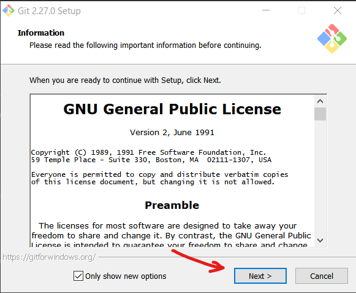
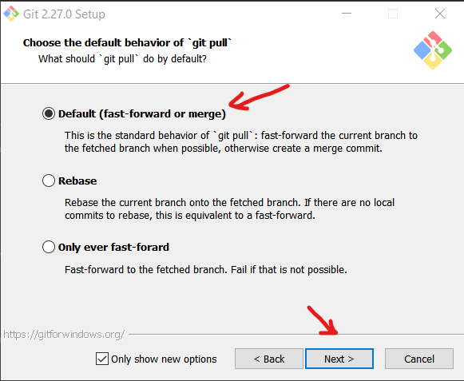
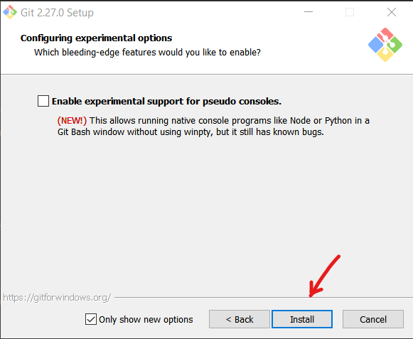

# Cài đặt Git cho Windows

Bộ cài đặt Git có thể download miễn phí ở: https://git-scm.com/

## Cài đặt Git lần đầu

## Update Git lên phiên bản cao hơn

Bước 1

Bước 2

Bước 3

Reboot máy tính để cài đặt có tác dụng.